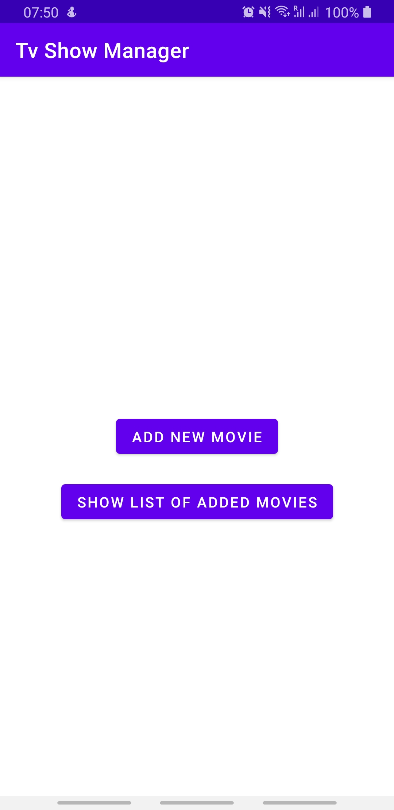
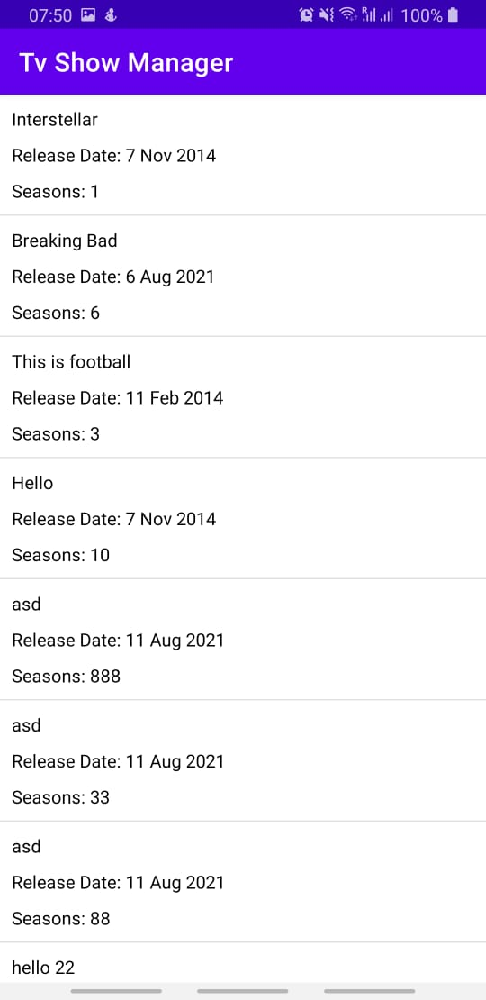
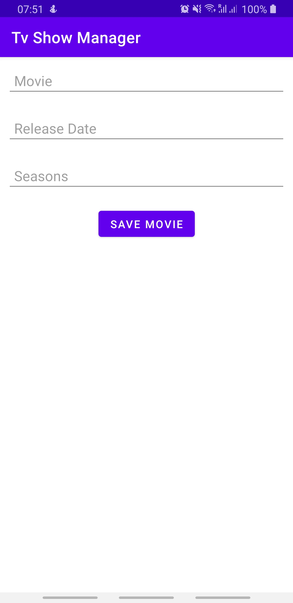

# Welcome to Apollo3 Tv Manager App.

It's an app built using the MVVM, Repository Pattern and Clean Architecture. It uses Apollo Client with normazlized cache for persisting data.

## Architecture
App is developed with Clean Architecture to maintain sepration of concern.

### Domain Layer

This layer contains pure business logic independent of platform and independent of other layers. This layer contains:

  1.  Business Models
  2.  Repositories interface
  3.  Use Cases

### Data Layer

This layer contains repository implementation provided by Domain layer. It uses Apollo3 With normalized cache.

## Presentation Layer
This layer contains android specific code. it handles user interactions and actions.

## Test
This applications is covered with unit. 

## CI
This App uses Github Actions for Continuous Integration.

## Libraries
  1.  Material Design - UI design
  2.  AndroidX - ViewModel, Compose
  3.  Coroutines
  4.  Hilt -  Dependency Injection
  5.  Navigation Component - User navigation
  6.  Apollo3 - query, and manage a data graph
  9.  Junit, mockito, Truth 

## Backlog

UI improvement & Instrumentation Test

   
